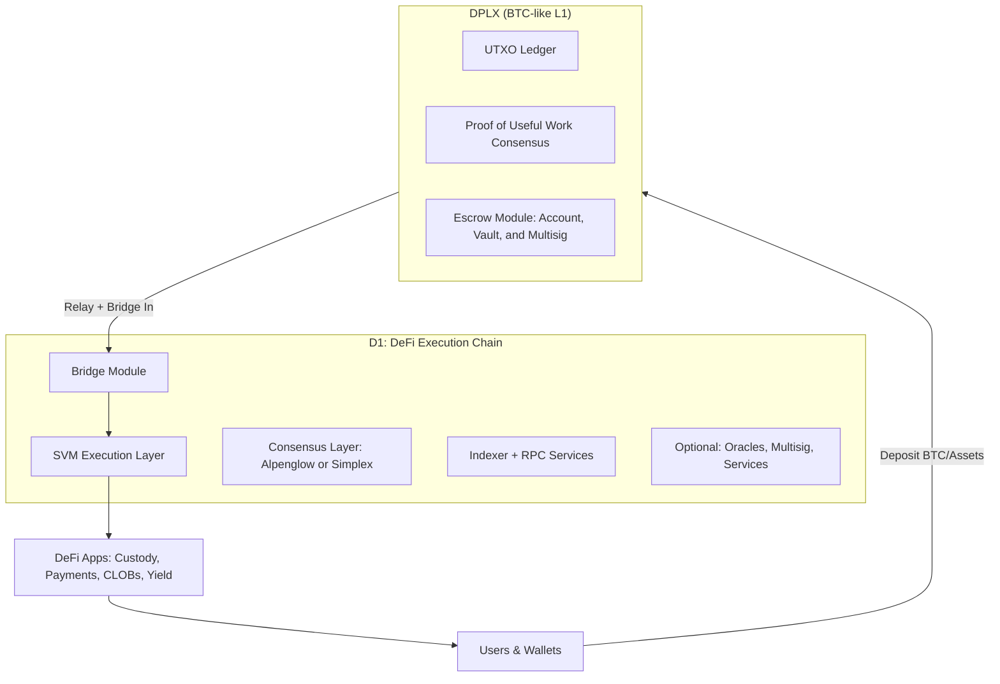
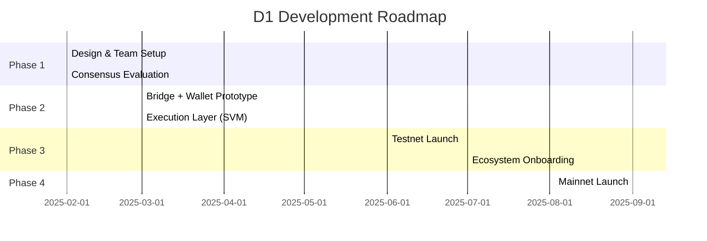

# Proposal: D1 — The DeFi Execution Layer for DPLX

## 1. Vision

**DPLX** is a Bitcoin-like chain secured by *Proof of Useful Work* (PoUW), where consensus is based on matrix multiplication lottery mechanics. While DPLX inherits the robustness and simplicity of Bitcoin, it lacks programmability.

**D1** is designed as the **DeFi execution chain for DPLX**, leveraging the Solana Virtual Machine (SVM) to enable high-throughput smart contracts. By bridging Bitcoin liquidity and other cross-chain assets into D1, we create a programmable Layer 1 environment tailored for DeFi.

**Objective**: Build a permissioned, SVM-based Layer 1 chain that evolves toward decentralization, supporting custody, payments, on-chain order books, and yield primitives — while unlocking the world’s newest untapped liquidity: Dplx.

---

## 2. Architecture Overview

Diagram references: SVM [3]; Consensus [5][6]; Indexer [2].

**Key Takeaway**: D1 is not just a bridge — it is a programmable Layer 1 ecosystem that extends DPLX’s security with SVM’s composability.

---

## 3. Core Components

### Wallet Integration

DPLX uses **secp256k1** while Solana SVM uses **Ed25519**, creating a key mismatch.

We propose three options:

* **(a) Two-wallet approach**: Simple to implement, higher UX friction.
* **(b) Modify DPLX**: Not feasible.
* **(c) Modify SVM to support secp256k1**: Preferred, as it unifies UX for users and simplifies developer integration.

Signature and hash algorithm use in BTC, ETH, and Solana are different.

| Feature | BTC | ETH | SOL |
| --- | --- | --- | --- |
| Algorithm | ECDSA (legacy), Schnorr (Taproot) | ECDSA | Ed25519 |
| Hash | SHA-256 | Keccak-256 | SHA-512 (used by Ed25519) |
| Interop | Shares secp256k1 with ETH; different tx formats | Shares secp256k1 with BTC; different hash/tx | Defaults to Ed25519; supports additional curves for bridging |

Table references: [1], [3], [7].

### Bridge Infrastructure

* **Bridge In**: Users deposit BTC (or other UTXO assets) → monitored by bitcoin SPV relay [5] → assets minted on D1.
* **Bridge Out**: Assets burned on D1 → standard L1 UTXO transaction back to DPLX. Optional escrow layer for audit [7].
* Reference architecture: Wormhole (Solana) [9].

### RPC + Indexing

* Wallet and transaction APIs for dApps [1][4].
* Indexing for real-time state queries [2].
* Reference: SolScan [2].

### Execution Layer

* **Solana SVM (Agave)**: High-performance runtime, familiar to developers, growing ecosystem [3].

### Consensus Layer

Two leading candidates (others: Tendermint [8]):

* **Alpenglow (Solana Labs)**: Cutting-edge, high-performance consensus. Strong alignment with Solana’s roadmap [5].
* **Simplex (Commonware)**: Production-ready SVM API integration, battle-tested abstractions [6].
Other options: Interchain Rust Tendermint [8],  Ethereum Reth POA [10].

Both options are backed by strong engineering teams → mitigates long-term risk.
Alpenglow is backed by Solana Labs, Simplex is backed by Commonware. Both have technlogy risk as they are new.
---

## 4. Tentative Roadmap to testnet and mainet (6 months needs to be refined)

* **Phase 1**: Team assembly, consensus selection.
* **Phase 2**: Wallet + bridge integration, SVM runtime.
* **Phase 3**: Permissioned testnet, early ecosystem onboarding (custody, payments, CLOBs).
* **Phase 4**: Mainnet launch with BTC and multi-chain asset support.

2 & 3 can be done in parallel.
---

## 5. Team & Execution Plan

**Team Composition (6–8 engineers)**

* 3 Consensus engineers (research + implementation).
* 3 Execution/runtime engineers (SVM integration).
* 2 DevOps & infra (deployment, monitoring, CI/CD).

**Timeline**:

* 6 months → Public testnet.
* 9 months → Mainnet launch.

**Partnerships**: Early alignment with Solana Labs (Alpenglow) and Commonware (Simplex) to secure support and technical collaboration.

---

## 6. Why Now?

* **Bitcoin Liquidity**: Over \$800B in capital remains largely idle in non-programmable chains.
* **Proven Runtime**: SVM has demonstrated scalability and developer traction.
* **DPLX Advantage**: Built-in security and unique Proof of Useful Work consensus.
* **Strategic Timing**: First-mover opportunity to merge Bitcoin-grade security with Solana-grade composability.

---

## 7. References

- [1] Ethereum Execution layer API: [ethereum/execution-apis](https://github.com/ethereum/execution-apis)
- [2] Solana indexer: [Solscan](https://solscan.io/)
- [3] Solana execution layer (SVM crate): [solana-svm on crates.io](https://crates.io/crates/solana-svm)
- [4] Phantom wallet documentation: [Phantom Docs](https://docs.phantom.com/introduction)
- [5] Alpenglow white paper: [Alpenglow v1.1 (PDF)](https://github.com/rogerANZA/Alpenglow-White-Paper/blob/main/Alpenglow-v1.1.pdf)
- [6] Simplex consensus: [Simplex: A Simple and Fast Consensus Protocol](https://ia.cr/2023/463)
- [7] Bitcoin SPV: [Simplified Payment Verification – BitcoinSV Wiki](https://wiki.bitcoinsv.io/index.php/Simplified_Payment_Verification)
- [8] Tendermint (Rust): [tendermint crate](https://crates.io/crates/tendermint)
- [9] Solana wormhole bridge: [Wormhole](https://wormhole.com/docs/products/token-transfers/native-token-transfers/overview/)
- [10] Reth POA: [Reth POA](https://ethereum.org/developers/docs/consensus-mechanisms/poa/)