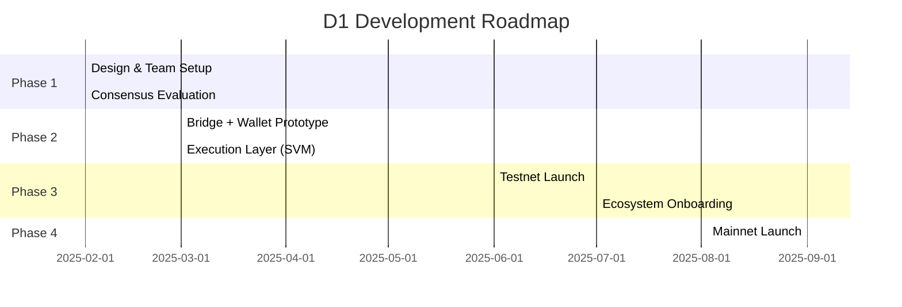

# Proposal: D1 — The DeFi Execution Layer for Duplex

## 1. Vision

**Duplex** is a Bitcoin-like chain secured by *Proof of Useful Work* (PoUW), where consensus is based on matrix multiplication lottery mechanics. While Duplex inherits the robustness and simplicity of Bitcoin, it lacks programmability.

**D1** is designed as the **DeFi execution chain for Duplex**, leveraging the Solana Virtual Machine (SVM) to enable high-throughput smart contracts. By bridging Bitcoin liquidity and other cross-chain assets into D1, we create a programmable Layer 1 environment tailored for DeFi.

**Objective**: Build a permissioned, SVM-based Layer 1 chain that evolves toward decentralization, supporting custody, payments, on-chain order books, and yield primitives — while unlocking the world’s largest untapped liquidity: Bitcoin.

---

## 2. Architecture Overview

```mermaid
flowchart TB
    subgraph Duplex["Duplex (BTC-like L1)"]
      UTXO[UTXO Ledger]
      PoUW[Proof of Useful Work Consensus]
    end

    subgraph D1["D1: DeFi Execution Chain"]
      SVM[SVM Execution Layer]
      Consensus[Consensus Layer (Alpenglow / Simplex)]
      Bridge[Bridge Module]
      Indexer[Indexer + RPC Services]
      Utils[Optional: Oracles, Multisig, Services]
    end

    User[Users & Wallets] -->|Deposit BTC/Assets| Duplex
    Duplex -->|Relay + Bridge In| Bridge
    Bridge --> SVM
    SVM --> dApps[DeFi Apps: Custody, Payments, CLOBs, Yield]
    dApps --> User
```

**Key Takeaway**: D1 is not just a bridge — it is a programmable Layer 1 ecosystem that extends Duplex’s security with SVM’s composability.

---

## 3. Core Components

### Wallet Integration

Duplex uses **secp256k1** while Solana SVM uses **Ed25519**, creating a key mismatch.

We propose three options:

* **(a) Two-wallet approach**: Simple to implement, higher UX friction.
* **(b) Modify Duplex**: Not feasible.
* **(c) Modify SVM to support secp256k1**: Preferred, as it unifies UX for users and simplifies developer integration.

### Bridge Infrastructure

* **Bridge In**: Users deposit BTC (or other UTXO assets) → monitored by relays → assets minted on D1.
* **Bridge Out**: Assets burned on D1 → standard L1 UTXO transaction back to Duplex. Optional escrow layer for audit.
* Reference architecture: Wormhole (Solana).

### RPC + Indexing

* Wallet and transaction APIs for dApps.
* Indexing for real-time state queries.
* Reference: SolScan.

### Execution Layer

* **Solana SVM (Agave)**: High-performance runtime, familiar to developers, growing ecosystem.

### Consensus Layer

Two leading candidates:

* **Alpenglow (Solana Labs)**: Cutting-edge, high-performance consensus. Strong alignment with Solana’s roadmap.
* **Simplex (Commonware)**: Production-ready SVM API integration, battle-tested abstractions.

Both options are backed by strong engineering teams → mitigates long-term risk.

---

## 4. Roadmap



* **Phase 1**: Team assembly, consensus selection.
* **Phase 2**: Wallet + bridge integration, SVM runtime.
* **Phase 3**: Permissioned testnet, early ecosystem onboarding (custody, payments, CLOBs).
* **Phase 4**: Mainnet launch with BTC and multi-chain asset support.

---

## 5. Team & Execution Plan

**Team Composition (6–8 engineers)**

* 3 Consensus engineers (research + implementation).
* 3 Execution/runtime engineers (SVM integration).
* 2 DevOps & infra (deployment, monitoring, CI/CD).

**Timeline**:

* 6 months → Public testnet.
* 9 months → Mainnet launch.

**Partnerships**: Early alignment with Solana Labs (Alpenglow) and Commonware (Simplex) to secure support and technical collaboration.

---

## 6. Why Now?

* **Bitcoin Liquidity**: Over \$800B in capital remains largely idle in non-programmable chains.
* **Proven Runtime**: SVM has demonstrated scalability and developer traction.
* **Duplex Advantage**: Built-in security and unique Proof of Useful Work consensus.
* **Strategic Timing**: First-mover opportunity to merge Bitcoin-grade security with Solana-grade composability.
